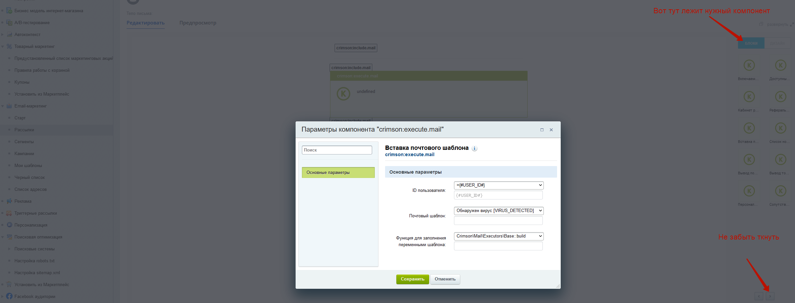

# crimson.emailtosender
Отправка через email маркетинг обычных почтовых шаблонов в 1С-Битрикс

1. Создаём собственный обработчик по примеру [executors/base.php](/local/modules/crimson.emailtosender/executors/base.php) и добавляем в init 
```
// Сборщик исполнителей для компонента crimson:execute.mail
\Bitrix\Main\EventManager::getInstance()->addEventHandler("crimson", "OnExecutorList",
        ['\Crimson\Mail\Executors\Base', 'loadExecutors']
);
```

2. Приведите email шаблон в приемлемый для отправки вид с помощью компонента include.mail
* Инклудим файл
```
<?EventMessageThemeCompiler::includeComponent(
	"crimson:include.mail",
	"",
	array_merge($arParams,['FILE'=>$_SERVER["DOCUMENT_ROOT"]."/local/templates/email-template/inc.php"])
);?> 
```
* Выводим тэги по условию
```
<?EventMessageThemeCompiler::includeComponent(
	"crimson:include.mail",
	"",
	array_merge($arParams,['array_key_exists'=>'SENDER_CHAIN_CODE','HTML'=>'</td></tr>'])
);?>
```

3. В модуле email-маркетинг создаём рассылку на основе нашего исправленного шаблона

4. Добавляем через визуальный редактор рассылок - компонент execute.mail


## API
```
$ex = new \Crimson\Mail\Sender\Creator();
/**
 * Создать рассылку на основе email шаблона и шаблона email события
 * @param string $title Заголовок письма
 * @param string $executorClass \Crimson\Mail\Executors\Base::build
 * @param string $templateEventType Код email события
 * @param string $templateCode Код email шаблона
 * @param string $from Отправитель (email)
 * @param array $segment Сегмент
 * @param boolean $run Запустить рассылку
 * @return int ID рассылки
 */
$ex->addFromMailTemplateAndIncludeEvent('Заголовок','\Crimson\Mail\Executors\Base::build','USER_INFO','email-template','mailer@domain.com', false, false));


/**
 * Создать рассылку с произвольным html на основе email шаблона
 * @param string $title Заголовок письма
 * @param string $htmlBodyContent HTML тела (без head/body)
 * @param string $templateCode Код email шаблона
 * @param string $from Отправитель (email)
 * @param array $segment Сегмент
 * @param boolean $run Запустить рассылку
 * @return int ID рассылки
 */
$ex->addFromMailTemplate('Заголовок','<div>content</div>','email-template','mailer@domain.com', false, false));


/**
 * Создать рассылку с произвольным HTML кодом
 * @param string $title Заголовок письма
 * @param string $html Целиком HTML (c html/body)
 * @param string $from Отправитель (email)
 * @param array $segment Сегмент [1]
 * @param boolean $run Запустить рассылку
 * @return int ID рассылки
 */
$ex->addHtml('Заголовок','content','mailer@domain.com', false, false);
```
# Установка
Скопировать модуль в /local/modules и установить через админку.

# Рекомендации
Их нет. Это костыль.